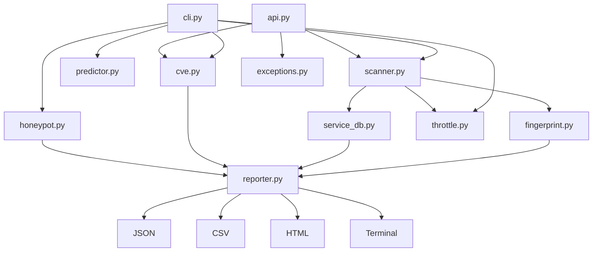

```
██████╗  ██████╗ ██████╗ ████████╗██╗  ██╗ █████╗ ██╗    ██╗██╗  ██╗
██╔══██╗██╔═══██╗██╔══██╗╚══██╔══╝██║  ██║██╔══██╗██║    ██║██║ ██╔╝
██████╔╝██║   ██║██████╔╝   ██║   ███████║███████║██║ █╗ ██║█████╔╝
██╔═══╝ ██║   ██║██╔══██╗   ██║   ██╔══██║██╔══██║██║███╗██║██╔═██╗
██║     ╚██████╔╝██║  ██║   ██║   ██║  ██║██║  ██║╚███╔███╔╝██║  ██╗
╚═╝      ╚═════╝ ╚═╝  ╚═╝   ╚═╝   ╚═╝  ╚═╝╚═╝  ╚═╝ ╚══╝╚══╝ ╚═╝  ╚═╝

         Async port scanner. Authorized targets only.
```

[](https://github.com/JakobBartoschek/porthawk/actions/workflows/ci.yml)
[](https://www.python.org/)
[](LICENSE)
[](DISCLAIMER.md)

PortHawk is an async TCP/UDP port scanner written in pure Python. It scans ports, extracts
service versions from banners, looks up CVEs for what it finds, and outputs results as a
live terminal UI, JSON, CSV, or a self-contained HTML report. No nmap, no external binaries.

---

## Features

- **Async TCP scanning** via `asyncio` — 500 concurrent connections by default, configurable
- **UDP scanning** via raw sockets (requires admin/root)
- **OS fingerprinting** from TTL value — Linux/Unix, Windows, Network Device
- **Service detection** — protocol-aware banner grabbing with version extraction for SSH, FTP, SMTP, POP3, IMAP, VNC, MySQL, Redis, Memcached
- **CVE lookup** via NVD API — version-aware: "OpenSSH 8.9" returns relevant CVEs, not just everything tagged "ssh". Two-layer cache (in-memory + disk, 24h TTL) to stay within rate limits
- **ML port prioritization** — logistic regression trained on internet-wide scan frequencies, adjusts for private IP ranges and OS hint (`pip install porthawk[ml]`)
- **Honeypot detection** — scores a host 0.0–1.0 for honeypot likelihood based on banner signatures (Cowrie, Dionaea), ICS port patterns (Conpot), port count (T-Pot), latency uniformity, and more
- **Adaptive scan speed** — AIMD concurrency control: starts conservative, ramps up on stable networks, backs off when timeouts spike. RFC 6298 SRTT/RTTVAR for jitter detection.
- **Service database** — ~200 common ports with names and descriptions
- **Risk scoring** — HIGH / MEDIUM / LOW per open port based on real-world exposure risk
- **Live terminal UI** — progress bar + live-updating open ports table + event log during scan
- **Multi-format output** — Rich terminal table, JSON, CSV, self-contained HTML
- **CIDR support** — scan `192.168.1.0/24` and it expands automatically
- **Stealth mode** — single-threaded, 3s timeout, less noise on the wire
- **Top N ports** — skip the 65535 full scan and focus on what matters
- **Python API** — `await porthawk.scan(...)` for programmatic use

---

## Architecture



---

## Installation

```bash
pip install porthawk
```

With ML port prioritization (scikit-learn):

```bash
pip install porthawk[ml]
```

Or from source:

```bash
git clone https://github.com/JakobBartoschek/porthawk
cd porthawk
pip install .
```

---

## Usage

**Scan top 100 ports on a single host:**
```bash
porthawk -t 192.168.1.1 --common
```

**Service version detection + OS fingerprint:**
```bash
porthawk -t 192.168.1.1 --common --banners --os
```

**CVE lookup — what's actually exploitable on the open ports:**
```bash
porthawk -t 192.168.1.1 --common --banners --cve
```

**Save to JSON and HTML:**
```bash
porthawk -t 192.168.1.1 -p 1-1024 --banners --cve -o json,html
```

**Scan a /24 network, top 50 ports:**
```bash
porthawk -t 192.168.1.0/24 --top-ports 50
```

**Full port scan with custom timeout:**
```bash
porthawk -t scanme.nmap.org --full --timeout 2.0 --threads 200
```

**Stealth mode with ML port ordering — likely-open ports first:**
```bash
porthawk -t 10.0.0.1 --common --stealth --smart-order
```

**Check if the target looks like a honeypot:**
```bash
porthawk -t 10.0.0.1 --common --banners --honeypot
```

**Adaptive scan — ramps up concurrency automatically:**
```bash
porthawk -t 192.168.1.1 -p 1-1024 --adaptive
```

**UDP scan (requires admin/root):**
```bash
sudo porthawk -t 192.168.1.1 -p 53,161,123 --udp
```

**Disable the live UI (for scripts, pipes, CI):**
```bash
porthawk -t 192.168.1.1 --common --no-live
```

**Set NVD_API_KEY to remove rate limiting (free at nvd.nist.gov):**
```bash
NVD_API_KEY=your-key porthawk -t 192.168.1.1 --common --cve --banners
```

**Example terminal output (with `--banners --cve`):**
```
PortHawk — scanning 192.168.1.1 (1 host, 100 ports, TCP)

  ┏━━━━━━━━━━━┳━━━━━━━━━━┳━━━━━━━━━━━━┳━━━━━━━━━━┳━━━━━━━━━━━━━━━━━━━━┳━━━━━━━━━━━━━━━━━━━━━━━━━━┓
  ┃ Port      ┃ State    ┃ Service    ┃ Risk     ┃ Banner             ┃ Top CVE                  ┃
  ┡━━━━━━━━━━━╇━━━━━━━━━━╇━━━━━━━━━━━━╇━━━━━━━━━━╇━━━━━━━━━━━━━━━━━━━━╇━━━━━━━━━━━━━━━━━━━━━━━━━━┩
  │ 22/tcp    │ open     │ ssh        │ MEDIUM   │ SSH OpenSSH_8.9p1  │ CVE-2023-38408 (9.8)     │
  │ 80/tcp    │ open     │ http       │ LOW      │ server: nginx/1.24 │ CVE-2023-44487 (7.5)     │
  │ 443/tcp   │ open     │ https      │ LOW      │ HTTP 200           │ —                        │
  │ 3306/tcp  │ open     │ mysql      │ MEDIUM   │ MySQL 8.0.33       │ CVE-2023-22005 (4.9)     │
  │ 6379/tcp  │ open     │ redis      │ HIGH     │ Redis 7.0.11       │ CVE-2022-0543 (10.0)     │
  └───────────┴──────────┴────────────┴──────────┴────────────────────┴──────────────────────────┘
  Open: 5 / 100 scanned
```

---

## Python API

PortHawk works as a library. No CLI required.

```python
import asyncio
import porthawk

# Full scan with banners and CVE lookup
results = asyncio.run(porthawk.scan(
    "192.168.1.1",
    ports="common",
    banners=True,
    cve_lookup=True,
))

for r in results:
    version = r.service_version or "unknown version"
    top_cve = r.cves[0]["cve_id"] if r.cves else "—"
    print(f"{r.port}/{r.protocol}  {r.service_name}  {version}  {top_cve}")
```

```python
# Context manager — same target, multiple scans
async with porthawk.Scanner("192.168.1.1", timeout=2.0) as scanner:
    web   = await scanner.scan(ports="80,443,8080,8443", banners=True)
    infra = await scanner.scan(ports="22,3306,5432,6379", cve_lookup=True)
```

```python
# Build a report and export
report    = porthawk.build_report("192.168.1.1", results)
html_path = porthawk.reporter.save_html(report)
```

```python
# Check if a host looks like a honeypot
hp = porthawk.score_honeypot(results)
print(f"{hp.verdict}  score={hp.score:.2f}  confidence={hp.confidence}")
for ind in hp.indicators:
    print(f"  [{ind.weight:.2f}] {ind.name}: {ind.description}")
```

Full API reference: [`docs/api.md`](docs/api.md)

---

## Example Output (JSON)

```json
{
  "metadata": {
    "target": "192.168.1.1",
    "scan_time": "2026-03-26T14:30:00",
    "total_ports": 100,
    "open_ports": 5,
    "protocol": "tcp",
    "version": "0.4.0",
    "timeout": 1.0,
    "max_concurrent": 500
  },
  "results": [
    {
      "host": "192.168.1.1",
      "port": 22,
      "protocol": "tcp",
      "state": "open",
      "banner": "SSH OpenSSH_8.9p1",
      "service_name": "ssh",
      "service_version": "OpenSSH_8.9p1",
      "risk_level": "MEDIUM",
      "os_guess": "Linux/Unix",
      "ttl": 64,
      "latency_ms": 0.8,
      "cves": [
        {
          "cve_id": "CVE-2023-38408",
          "cvss_score": 9.8,
          "severity": "CRITICAL",
          "description": "Remote code execution in ssh-agent...",
          "published": "2023-07-19",
          "url": "https://nvd.nist.gov/vuln/detail/CVE-2023-38408"
        }
      ]
    }
  ]
}
```

---

## MITRE ATT&CK Mapping

| Technique | ID | Description |
|-----------|-----|-------------|
| Network Service Discovery | [T1046](https://attack.mitre.org/techniques/T1046/) | TCP/UDP port scanning to identify open services |
| Active Scanning: Scanning IP Blocks | [T1595.001](https://attack.mitre.org/techniques/T1595/001/) | CIDR range scanning across IP blocks |
| Gather Victim Host Info: Client Configurations | [T1592.004](https://attack.mitre.org/techniques/T1592/004/) | OS fingerprinting via TTL, banner-based version detection |

---

## Testing

```bash
# Install test dependencies
pip install -r requirements-dev.txt

# Run tests with coverage
pytest tests/ --cov=porthawk --cov-report=term-missing

# Run a specific test file
pytest tests/test_scanner.py -v

# Run with short output
pytest tests/ --tb=short
```

Coverage target: **>90%** on all modules.
All network calls are mocked — tests run without any real connections.

---

## Roadmap

- [x] CVE lookup via NVD API per detected service/version
- [x] Version-aware service detection (SSH, FTP, MySQL, Redis, ...)
- [x] ML port prioritization via logistic regression
- [x] Persistent CVE disk cache with TTL
- [x] Honeypot detection — score-based detection for Cowrie, Dionaea, Conpot, T-Pot
- [x] Adaptive scan speed — AIMD concurrency control with RFC 6298 RTT smoothing
- [ ] Nmap XML import and diff/compare mode
- [ ] Web dashboard with Flask
- [ ] Slack and Discord webhook alerts for HIGH-risk open ports
- [ ] IPv6 support

---

## Contributing

See [CONTRIBUTING.md](CONTRIBUTING.md) for setup instructions, branch naming,
code style, and how to write a good PR.

---

## Legal

PortHawk is for **authorized penetration testing only**.
You must have written permission from the target owner before scanning.
Unauthorized port scanning may violate the CFAA (USA), Computer Misuse Act (UK),
§202a StGB (Germany), and equivalent laws in your jurisdiction.

See [DISCLAIMER.md](DISCLAIMER.md) for the full legal disclaimer.

---

## License

MIT License — see [LICENSE](LICENSE) file.
