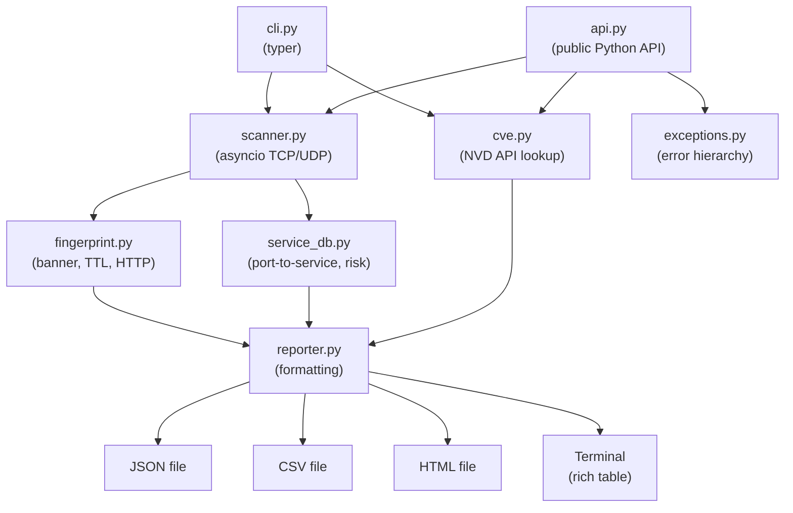

```
██████╗  ██████╗ ██████╗ ████████╗██╗  ██╗ █████╗ ██╗    ██╗██╗  ██╗
██╔══██╗██╔═══██╗██╔══██╗╚══██╔══╝██║  ██║██╔══██╗██║    ██║██║ ██╔╝
██████╔╝██║   ██║██████╔╝   ██║   ███████║███████║██║ █╗ ██║█████╔╝
██╔═══╝ ██║   ██║██╔══██╗   ██║   ██╔══██║██╔══██║██║███╗██║██╔═██╗
██║     ╚██████╔╝██║  ██║   ██║   ██║  ██║██║  ██║╚███╔███╔╝██║  ██╗
╚═╝      ╚═════╝ ╚═╝  ╚═╝   ╚═╝   ╚═╝  ╚═╝╚═╝  ╚═╝ ╚══╝╚══╝ ╚═╝  ╚═╝

         Async port scanner. Authorized targets only.
```

[](https://github.com/JakobBartoschek/porthawk/actions/workflows/ci.yml)
[](https://www.python.org/)
[](LICENSE)
[](DISCLAIMER.md)

PortHawk is an async TCP/UDP port scanner written in pure Python. It does banner grabbing,
OS fingerprinting from TTL, risk scoring, and outputs results as terminal tables, JSON, CSV,
or a self-contained HTML report. It runs on anything with Python 3.10+, no root required for TCP.

---

## Features

- **Async TCP scanning** via `asyncio` — 500 concurrent connections by default, configurable
- **UDP scanning** via raw sockets (requires admin/root)
- **OS fingerprinting** from TTL value — Linux/Unix, Windows, Network Device
- **Banner grabbing** — SSH version, HTTP headers, FTP/SMTP banners
- **CVE lookup** via NVD API — see `CVE-2022-0543 (10.0)` next to that open Redis port
- **Service database** — ~200 common ports with names and descriptions
- **Risk scoring** — HIGH / MEDIUM / LOW per open port based on real-world exposure risk
- **Multi-format output** — Rich terminal table, JSON, CSV, self-contained HTML
- **CIDR support** — scan `192.168.1.0/24` and it expands automatically
- **Stealth mode** — single-threaded, 3s timeout, less noise on the wire
- **Top N ports** — skip the 65535 full scan and focus on what matters
- **Python API** — `await porthawk.scan(...)` for programmatic use

---

## Architecture



---

## Installation

```bash
pip install porthawk
```

Or from source:

```bash
git clone https://github.com/JakobBartoschek/porthawk
cd porthawk
pip install .
```

---

## Usage

**Scan top 100 ports on a single host:**
```bash
porthawk -t 192.168.1.1 --common
```

**Banner grabbing with OS detection, save to JSON and HTML:**
```bash
porthawk -t 192.168.1.1 -p 1-1024 --banners --os -o json,html
```

**Scan a /24 network, top 50 ports:**
```bash
porthawk -t 192.168.1.0/24 --top-ports 50
```

**Full port scan with custom timeout and thread limit:**
```bash
porthawk -t scanme.nmap.org --full --timeout 2.0 --threads 200
```

**Stealth mode — slow, single-threaded, 3s timeout:**
```bash
porthawk -t 10.0.0.1 --common --stealth
```

**UDP scan (requires admin/root):**
```bash
sudo porthawk -t 192.168.1.1 -p 53,161,123 --udp
```

**CVE lookup — see what's actually exploitable:**
```bash
porthawk -t 192.168.1.1 --common --cve
```

**Set NVD_API_KEY to remove rate limiting (free at nvd.nist.gov):**
```bash
NVD_API_KEY=your-key porthawk -t 192.168.1.1 --common --cve --banners
```

**Example terminal output:**
```
PortHawk — scanning 192.168.1.1 (1 host, 100 ports, TCP)

  192.168.1.1 100%|████████████████████| 100/100 [00:02<00:00]

  ┏━━━━━━━━━━━┳━━━━━━━━━━┳━━━━━━━━━━━━━━━━━━━━┳━━━━━━━━━━┳━━━━━━━━━━━━━━━━━━━━┓
  ┃ Port      ┃ State    ┃ Service            ┃ Risk     ┃ Banner / Info      ┃
  ┡━━━━━━━━━━━╇━━━━━━━━━━╇━━━━━━━━━━━━━━━━━━━━╇━━━━━━━━━━╇━━━━━━━━━━━━━━━━━━━━┩
  │ 22/tcp    │ open     │ ssh                │ MEDIUM   │ SSH OpenSSH_8.9p1  │
  │ 80/tcp    │ open     │ http               │ LOW      │ server: nginx/1.24 │
  │ 443/tcp   │ open     │ https              │ LOW      │ HTTP 200           │
  │ 3306/tcp  │ open     │ mysql              │ MEDIUM   │                    │
  │ 6379/tcp  │ open     │ redis              │ HIGH     │ +PONG              │
  └───────────┴──────────┴────────────────────┴──────────┴────────────────────┘
  Open: 5 / 100 scanned
```

---

## Python API

PortHawk works as a library too. No CLI required.

```python
import asyncio
import porthawk

# Scan + CVE lookup in one call
results = asyncio.run(porthawk.scan("192.168.1.1", ports="common", cve_lookup=True))
for r in results:
    top_cve = r.cves[0]["cve_id"] if r.cves else "—"
    print(f"{r.port}/{r.protocol}  {r.service_name}  {r.risk_level}  {top_cve}")
```

```python
# Context manager — useful when scanning the same target multiple times
async with porthawk.Scanner("192.168.1.1", timeout=2.0) as scanner:
    web   = await scanner.scan(ports="80,443,8080,8443", banners=True)
    infra = await scanner.scan(ports="22,3306,5432,6379")
```

```python
# Build a report and export it
report   = porthawk.build_report("192.168.1.1", results)
html_path = porthawk.reporter.save_html(report)
```

Full API reference: [`docs/api.md`](docs/api.md)

---

## Example Output (JSON)

```json
{
  "metadata": {
    "target": "192.168.1.1",
    "scan_time": "2026-03-25T14:30:00",
    "total_ports": 100,
    "open_ports": 5,
    "protocol": "tcp",
    "version": "0.1.0",
    "timeout": 1.0,
    "max_concurrent": 500
  },
  "results": [
    {
      "host": "192.168.1.1",
      "port": 22,
      "protocol": "tcp",
      "state": "open",
      "banner": "SSH OpenSSH_8.9p1",
      "service_name": "ssh",
      "risk_level": "MEDIUM",
      "os_guess": "Linux/Unix",
      "ttl": 64,
      "latency_ms": 0.8
    }
  ]
}
```

---

## MITRE ATT&CK Mapping

| Technique | ID | Description |
|-----------|-----|-------------|
| Network Service Discovery | [T1046](https://attack.mitre.org/techniques/T1046/) | TCP/UDP port scanning to identify open services |
| Active Scanning: Scanning IP Blocks | [T1595.001](https://attack.mitre.org/techniques/T1595/001/) | CIDR range scanning across IP blocks |
| Gather Victim Host Info: Client Configurations | [T1592.004](https://attack.mitre.org/techniques/T1592/004/) | OS fingerprinting via TTL, banner-based version detection |

---

## Testing

```bash
# Install test dependencies
pip install -r requirements-dev.txt

# Run tests with coverage
pytest tests/ --cov=porthawk --cov-report=term-missing

# Run a specific test file
pytest tests/test_scanner.py -v

# Run with short output
pytest tests/ --tb=short
```

Coverage target: **>90%** on all modules.
All network calls are mocked — tests run without any real connections.

---

## Roadmap

- [ ] CVE lookup via NVD API per detected service/version
- [ ] Nmap XML import and diff/compare mode
- [ ] Web dashboard with Flask (already installed as optional dep)
- [ ] Slack and Discord webhook alerts for HIGH-risk open ports
- [ ] IPv6 support

---

## Contributing

See [CONTRIBUTING.md](CONTRIBUTING.md) for setup instructions, branch naming,
code style, and how to write a good PR.

---

## Legal

PortHawk is for **authorized penetration testing only**.
You must have written permission from the target owner before scanning.
Unauthorized port scanning may violate the CFAA (USA), Computer Misuse Act (UK),
§202a StGB (Germany), and equivalent laws in your jurisdiction.

See [DISCLAIMER.md](DISCLAIMER.md) for the full legal disclaimer.

---

## License

MIT License — see [LICENSE](LICENSE) file.
