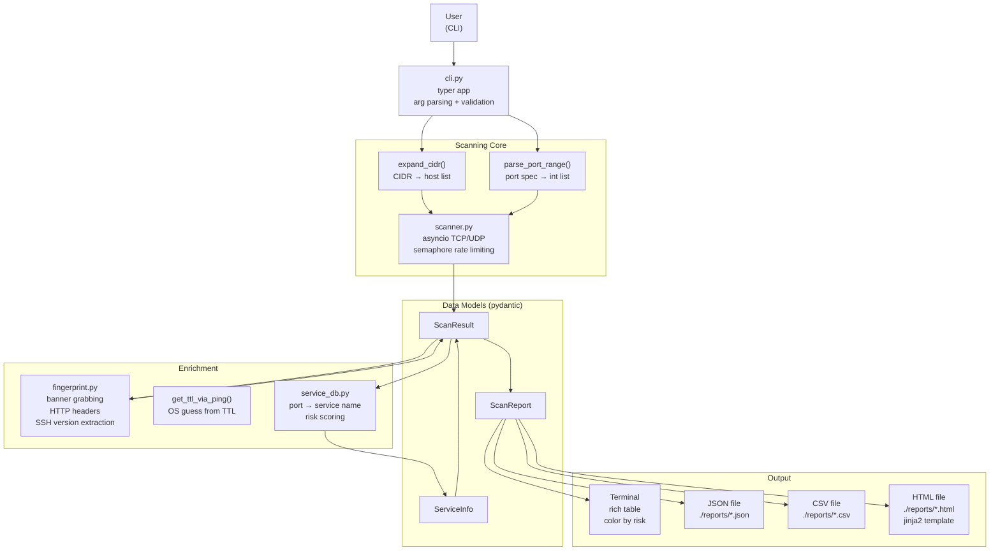

# PortHawk Architecture

## System Overview



---

## Module Breakdown

### `cli.py` — The Thin Controller

**In:** Command-line arguments from the user
**Out:** Exit code, terminal output, report files

Responsibilities:
- Parse and validate CLI arguments (typer handles the heavy lifting)
- Resolve port specifications (`--common`, `--top-ports N`, `-p 1-1024`, `--full`)
- Expand CIDR targets
- Call `scan_targets()` via `asyncio.run()`
- Enrich results with service info and banners
- Delegate rendering to `reporter.py`

**What it does NOT do:** Any network logic. Any formatting logic beyond calling reporter functions.

---

### `scanner.py` — The Core

**In:** Host list, port list, timeout, max_concurrent, protocol
**Out:** `list[ScanResult]` — one per port, all states (open/closed/filtered)

This is where asyncio actually runs. Key design decisions:

1. **Semaphore for rate limiting** — `asyncio.Semaphore(max_concurrent)` wraps every port probe.
   Without this, scanning 65535 ports would try to open 65535 connections simultaneously,
   which exhausts file descriptors on Linux (ulimit -n default is 1024).

2. **`asyncio.open_connection()` for TCP** — higher level than raw sockets, handles
   ProactorEventLoop/SelectorEventLoop differences between Windows and Linux automatically.

3. **Executor for UDP** — raw sockets don't have native asyncio support. UDP probes run
   in a thread via `loop.run_in_executor()`.

4. **Returns all states** — caller decides what to display. Scanner doesn't filter.

---

### `fingerprint.py` — Best-Effort Identification

**In:** Open port (host, port, timeout)
**Out:** Optional string — banner, HTTP header summary, or SSH version

Three strategies, tried in order:
1. **HTTP ports (80, 443, 8080, etc.)** → `httpx.AsyncClient.head()` — pulls Server header
2. **Raw banner** → connect + send `\r\n` + read 1024 bytes — works for SSH, FTP, SMTP
3. **SSH detection** → if banner starts with `SSH-`, extract the software version

OS detection lives here too but uses `subprocess.run(ping)` rather than raw sockets,
which works cross-platform without root.

---

### `service_db.py` — Static Data, Zero I/O

**In:** Port number + protocol string
**Out:** `ServiceInfo` (pydantic model) with name, description, risk level

Intentionally boring. A hardcoded dict is:
- Faster than a database lookup
- More predictable than an API call
- Offline-capable
- Easy to diff in git when someone changes risk levels

Risk levels are opinionated but based on common pentest findings:
- HIGH = "this being open on the internet is a problem right now"
- MEDIUM = "legitimate but needs justification if internet-facing"
- LOW = "expected, just make sure it's configured correctly"
- INFO = "open, not classified"

---

### `reporter.py` — All Display Logic

**In:** `ScanReport` (pydantic model with metadata + results)
**Out:** Terminal output, files

Four renderers:
- `print_terminal()` — rich Console + Table, color by risk level
- `save_json()` — pydantic's `model_dump_json()` with indent=2
- `save_csv()` — stdlib csv.DictWriter, flat one-row-per-port
- `save_html()` — Jinja2 template embedded in the module (no external files)

All files go to `./reports/` with `YYYYMMDD_HHMMSS` timestamps. Running the tool
twice never overwrites the previous output.

---

## Data Flow — Full Scan Lifecycle

```
1. User:    porthawk scan -t 192.168.1.1 --common --banners -o json
2. cli.py:  parse args → expand_cidr("192.168.1.1") → ["192.168.1.1"]
            parse "common" → get_top_ports(100) → [80, 443, 22, ...]
3. scanner: asyncio.run(scan_targets(["192.168.1.1"], [80,443,22,...]))
            → creates 100 asyncio tasks, semaphore limits to 500 concurrent
            → _tcp_probe() for each port → ScanResult per port
4. cli.py:  _enrich_results() — calls get_service() for each result
            get_ttl_via_ping() if --os, fingerprint_port() for open ports if --banners
5. reporter: build_report() → ScanReport
             print_terminal(report) → rich table to stdout
             save_json(report) → reports/scan_20260325_143000.json
```

---

## Design Decisions

### Why asyncio instead of threading?

Port scanning is almost entirely I/O-bound — you're waiting for the network 99% of the time.
The GIL isn't a problem. asyncio gives cleaner cancellation, better Windows compatibility
in Python 3.10+, and genuinely parallel I/O without thread overhead.

Alternative considered: `concurrent.futures.ThreadPoolExecutor` — rejected because async
cancellation is cleaner and asyncio.Semaphore is simpler than ThreadPoolExecutor's queue.

### Why pydantic for data models?

Free validation + `.model_dump_json()` means zero custom serialization code. In pydantic v2
(which is what's installed), it's also significantly faster than v1. The alternative —
stdlib `@dataclass` — would require a custom JSON encoder for the JSON report.

### Why pure Python with no nmap dependency?

This is a portfolio project that demonstrates Python async skills. Wrapping nmap would
hide the interesting parts. Pure Python also means fewer installation issues (nmap binary
not required) and makes the code more educational.

### Why not use scapy for UDP?

scapy would require a separate installation and potentially complex dependency management.
The raw socket approach covers the use case for v0.1.0 without adding a large dependency.
